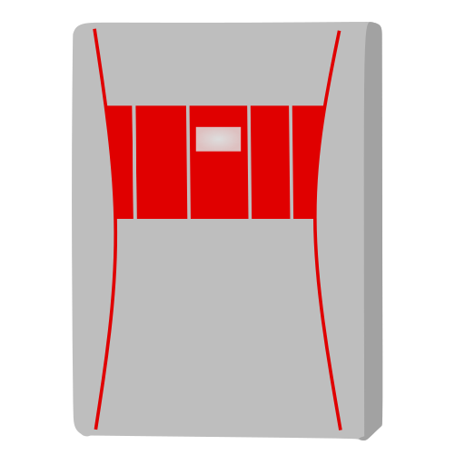

# Benning Solar Inverter Home Assistant Integration

The Benning Solar Inverter Home Assistant integration is an integration that allows you to access all available statistics from Benning Solar Inverter TLS Series and make them available in HASS. It is running purely locally by accessing the local API of the inverter.

## Installation

### Using HACS

Currently, this plugin is not integrated in the HACS registry, so you will have to install it manually.

1. Please go to the HACS page of your Home Assistant Web Interface.
2. Click the three dots on the top right.
3. Click "custom repositories"
4. Add the URL of this repository: https://github.com/simaxme/hass-benning-solar-inverter.git
5. Select "Integration" as type
6. Click "Add"

Now you should see the Integration in HACS.

### Manually

You can download this repository and copy the `custom_components/benningsolarinverter` folder to your `config/custom_components/` folder of your personal instance.

## Setup

This plugin can be set up by going to `Settings > Devices` and clicking on the `Add Integration`-Button.

There, you will need to input the following values:

- `Host`: The hotsname or IP-Adress of your Benning Solar Inverter in the current network.
- `Username`: The username of your admin account. Typically `admin`.
- `Password`: The password of your admin account. Typically `benning`.

After clicking on `Ok`, it may **take multiple minutes** till the integration has finished setting up. **This is expected behavior**, because the API does not provide a list of all available endpoints. The integration simply checks for a huge range of numbers, whether there is an endpoint existing or not. 
Note this will be only done on setup, so don't worry that the integration takes that long at first.

## Compatibility

Currently this integration was tested on the following Benning Solar Inverters:

- [x] Benning TLS 4.3

I do not know whether there may have been API changes in other versions of the inverter. If you have another inverter model, feel free to write whether yours works properly or has issues, so I can fix possible bugs.

## FAQ

### Setting up the integration takes very long, why?

The first time the integration is setup, it needs to get all available endpoints/values that can be mapped to a sensor in HASS. Because the API does not provide endpoints for checking these, it will "bruteforce" all available endpoints by checking a huge range of identifiers.
Though the API documentation includes a table of all OIDs with their mappings, they do not always seem to properly match.
